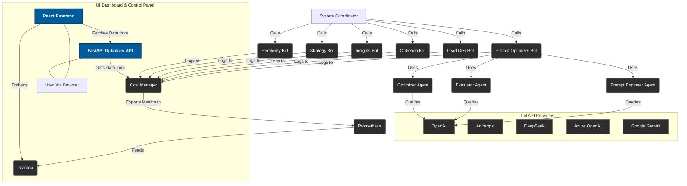

# Business Development Automation System

A comprehensive, production-ready automation system for business development workflows with advanced prompt optimization, cost tracking, and monitoring capabilities.

## 🌟 Overview

The Business Development Automation System provides an integrated platform for:
- **Lead Generation**: Automated prospect identification and qualification
- **Outreach Automation**: Personalized email and LinkedIn campaigns
- **Market Research**: AI-powered insights and competitive analysis
- **Strategy Development**: Data-driven business strategy recommendations
- **Prompt Optimization**: MetaGPT-powered prompt engineering and refinement
- **Cost Management**: Real-time tracking and monitoring of LLM API costs
- **Performance Analytics**: Comprehensive monitoring with Grafana dashboards

## 🏗️ System Architecture



## ✨ Key Features

### 🤖 Multi-Agent Business Development
- **Lead Generation Bot**: Automated prospect identification and scoring
- **Outreach Bot**: Personalized multi-channel communication campaigns
- **Insights Bot**: Market research and competitive intelligence
- **Strategy Bot**: Business strategy recommendations and planning
- **Perplexity Bot**: Advanced market research with real-time data

### 🧠 Prompt Optimization (MetaGPT Integration)
- **Automated Prompt Engineering**: Multi-agent optimization cycles
- **Performance Evaluation**: Quantitative prompt quality assessment
- **Cost Optimization**: Token usage reduction while maintaining quality
- **Flexible Strategies**: Orchestrator and CLI-based optimization modes
- **Backward Compatibility**: Seamless integration with existing workflows

### 💰 Advanced Cost Tracking & Monitoring
- **Real-time Cost Tracking**: Track API costs across all LLM providers
- **Prometheus Metrics**: 7 custom metrics for comprehensive monitoring
- **Grafana Dashboards**: 8 visualization panels for cost and performance trends
- **Session-based Reporting**: Detailed cost breakdowns by operation
- **Multi-provider Support**: OpenAI, Anthropic, DeepSeek, Azure, and more

### 🧪 Comprehensive Testing Framework
- **Unit Tests**: Full coverage of core functionality with mocked LLM calls
- **Integration Tests**: End-to-end testing of all system components
- **CI/CD Pipeline**: GitHub Actions with conda environment support
- **Docker Integration**: Containerized testing and deployment
- **Security Scanning**: Automated security and dependency vulnerability checks

### 🖥️ UI Dashboard & Control Panel
- **Overview**: A React-based single-page application for real-time monitoring of prompt optimization runs and manual prompt optimization.
- **Features**:
    - **Recent Optimization Runs**: Table displaying prompt snippets, costs, tokens, and latency.
    - **LLM Cost Trends**: Embedded Grafana panels for live cost visualization.
    - **Manual Optimization Form**: User interface to submit prompts for optimization and view results.
- **Tech Stack**: React, Vite, TypeScript, Tailwind CSS (frontend); FastAPI (backend).
- **Access**: The dashboard runs on `http://localhost:5173` (frontend) and `http://localhost:8000` (backend API) when deployed via Docker Compose.

## 🚀 Quick Start

### Prerequisites
- Python 3.9+ 
- Conda (recommended) or Python virtual environment
- Docker (optional, for containerized deployment)
- API keys for LLM providers (OpenAI, Anthropic, etc.)

### Installation

1. **Clone and Setup Environment**
```bash
git clone <repository-url>
cd business_dev_automation

# Using conda (recommended)
conda env create -f environment.yml
conda activate business-dev-automation

# Or using pip
pip install -r requirements.txt
```

2. **Configure Environment Variables**
```bash
cp .env.example .env
# Edit .env with your API keys and configuration
```

3. **Verify Installation**
```bash
# Run cost tracking tests
python test_cost_tracking.py

# Run comprehensive integration tests
python test_integration.py
```

## 📊 Cost Tracking & Monitoring

### Prometheus Metrics
The system exports 7 custom metrics on port 8000:

| Metric | Type | Description |
|--------|------|-------------|
| `llm_api_cost_total` | Counter | Total cost of LLM API calls |
| `llm_api_tokens_total` | Counter | Total tokens used (by type) |
| `llm_api_calls_total` | Counter | Total number of API calls |
| `llm_operation_duration_seconds` | Histogram | Duration of LLM operations |
| `llm_active_operations` | Gauge | Number of active operations |
| `metagpt_optimization_cycles_total` | Counter | MetaGPT optimization cycles |
| `metagpt_agent_actions_total` | Counter | MetaGPT agent actions |

### Grafana Dashboard
Pre-configured dashboard with 8 panels:
- Total API Cost trends
- Token usage rates by provider
- API calls distribution
- Cost breakdown by operation
- MetaGPT optimization cycles
- Agent action tracking
- Operation duration metrics
- Active operations monitoring

### Cost Manager Usage
```python
from shared.cost_manager import get_cost_manager

# Start cost tracking
cm = get_cost_manager()
report = cm.start_operation("my_operation")

# API calls are automatically tracked
# ... your LLM API calls ...

# Complete and get report
final_report = cm.complete_operation("my_operation")
print(f"Total cost: ${final_report.total_cost}")
```

## 🎯 Prompt Optimization

### Basic Usage
```bash
# Optimize a prompt using the system coordinator
python system_coordinator.py --optimize-prompts --input "Write a greeting message"

# Direct optimization call
python prompt_optimizer_bot/demo_cli.py --prompt "Your prompt here" --strategy orchestrator
```

### Advanced Configuration
```python
from prompt_optimizer_bot.optimize_prompt import optimize_prompt

# Optimize with specific strategy
result = optimize_prompt(
    original_prompt="Your prompt here",
    strategy="orchestrator",  # or "cli"
    use_legacy_cli=False,
    max_iterations=5
)

print(f"Optimized prompt: {result}")
```

## 🧪 Testing

### Running Tests
```bash
# Cost tracking tests
python test_cost_tracking.py

# Integration tests (comprehensive)
python test_integration.py

# Pytest compatibility
pytest test_integration.py

# CI/CD pipeline
pytest test_integration.py --verbose
```

### Test Coverage
- **API to Cost Manager Integration**: 2/2 tests
- **Cost Manager to Prometheus Integration**: 2/2 tests  
- **Prometheus to Grafana Integration**: 2/2 tests
- **End-to-End Data Flow**: 1/1 tests
- **Optimization Workflow Integration**: 1/1 tests

## 🐳 Docker Deployment

### Development Environment
```bash
# Integration testing with Docker
docker-compose -f docker-compose.integration.yml up

# Build integration test image
docker build -f Dockerfile.integration -t business-dev-automation:integration .

# For UI Dashboard Development
docker-compose -f docker-compose.dashboard.yml up --build
```

### Production Deployment
```bash
# Standard deployment
docker-compose up -d

# With monitoring stack
docker-compose -f docker-compose.yml -f docker-compose.monitoring.yml up -d
```

## ⚖️ Scalability

### Horizontal Scaling Strategy
- **FastAPI Backend (optimizer_api)**: Achieved through running multiple Uvicorn workers (e.g., using Gunicorn in production) across several pods. Kubernetes Horizontal Pod Autoscaler (HPA) can automatically adjust replica counts based on CPU utilization or custom metrics.
- **React Frontend (optimizer-dashboard)**: Built as static assets and served efficiently from a Content Delivery Network (CDN) or a simple web server (like Nginx) for optimal performance and scalability, with multiple replicas for high availability.

### Service Level Objectives (SLOs)
- **API Latency**: p95 latency for `/optimizer/runs` and `/optimizer/optimize` endpoints should be under 500ms.
- **Error Rate**: Less than 0.1% HTTP 5xx errors for all API endpoints.
- **Uptime**: 99.9% availability for both API and UI services.

## 📈 Monitoring & Observability

### Prometheus Configuration
- **Scrape Interval**: 5 seconds for real-time monitoring
- **Targets**: Business dev automation (port 8000), integration tests
- **Retention**: Configurable (default 15 days)

### Grafana Setup
- **Datasource**: Prometheus (http://prometheus:9090)
- **Dashboard**: Pre-configured LLM cost tracking dashboard
- **Alerts**: Configurable cost thresholds and anomaly detection

### Log Management
- **Token Logs**: Session-based cost tracking in `token_logs/`
- **Operation Logs**: Detailed operation tracking with metadata
- **Error Handling**: Comprehensive error logging and recovery

## 🔧 Configuration

### Environment Variables
```bash
# LLM API Keys
OPENAI_API_KEY=your_openai_key
ANTHROPIC_API_KEY=your_anthropic_key
DEEPSEEK_API_KEY=your_deepseek_key

# Azure OpenAI (optional)
AZURE_OPENAI_API_KEY=your_azure_key
AZURE_OPENAI_MODEL_DEPLOYMENT=gpt-4o-ms

# Google Gemini (optional)
GOOGLE_API_KEY=your_google_key

# Monitoring Configuration
PROMETHEUS_PORT=8000
GRAFANA_PORT=3000

# OIDC Configuration (for UI Dashboard Authentication)
OIDC_CLIENT_ID=your_oidc_client_id
OIDC_CLIENT_SECRET=your_oidc_client_secret
OIDC_ISSUER_URL=https://your-oidc-provider.com/
OIDC_REDIRECT_URI=http://localhost:8000/callback
OIDC_ROLES_CLAIM=roles # e.g., 'roles', 'groups', or a custom claim name from your IdP

```

### Cost Manager Configuration
```python
# Custom configuration
cm = get_cost_manager(
    enable_prometheus=True,
    prometheus_port=8000
)
```

## 🚀 Development Roadmap

### ✅ Completed Features
- [x] Multi-agent business development bots
- [x] MetaGPT prompt optimization integration
- [x] Comprehensive cost tracking system
- [x] Prometheus metrics and Grafana dashboards
- [x] Integration testing framework
- [x] CI/CD pipeline with GitHub Actions
- [x] Docker containerization

### 🔄 In Progress
- [ ] UI Dashboard & Control Panel (React + FastAPI)
- [ ] Enhanced documentation and developer guides

### 📋 Planned Features
- [ ] Advanced authentication system (OIDC)
- [ ] Multi-tenant support
- [ ] Advanced cost alerting and budgeting
- [ ] Performance optimization recommendations
- [ ] Extended LLM provider support

## 🤝 Contributing

### Development Setup
1. Fork the repository
2. Create a feature branch
3. Install development dependencies: `conda env create -f environment.yml`
4. Run tests: `python test_integration.py`
5. Submit a pull request

### Developer Onboarding
This section provides a guide for new developers to quickly get up to speed with the project.

#### 1. System Overview
- Review the `README.md` for a high-level understanding of the system architecture, key features, and components.
- Pay special attention to the [System Architecture](#-system-architecture) diagram to visualize component interactions.

#### 2. Environment Setup
- Follow the [Installation](#installation) steps under `Quick Start` to set up your local development environment.
- Ensure all prerequisites are met and environment variables are configured correctly.

#### 3. Codebase Walkthrough
- **Backend (`business_dev_automation/optimizer_api/`)**:
    - `main.py`: FastAPI application entry point, API routes, OIDC integration, and CostManager hooks.
    - `models.py`: Pydantic models for API request/response and data validation.
    - `Dockerfile`, `requirements.txt`: Dockerization and Python dependencies.
- **Frontend (`frontend/optimizer-dashboard/`)**:
    - `src/App.tsx`: Main React application component, state management, and component integration.
    - `src/components/`: Reusable React components (`RunTable`, `CostChart`, `PromptForm`).
    - `src/types.ts`: TypeScript interfaces for frontend data models.
    - `tailwind.config.js`, `src/index.css`: Tailwind CSS configuration and main styles.
    - `Dockerfile.dev`: Dockerization for the frontend development server.
- **Shared Utilities (`business_dev_automation/shared/`)**:
    - `cost_manager.py`: Centralized cost tracking logic and Prometheus metrics.
- **Prompt Optimization Logic (`business_dev_automation/prompt_optimizer_bot/utils/`)**:
    - `optimize_prompt.py`: Unified entry point for prompt optimization logic.

#### 4. Running the Dashboard Locally

To run the PromptOptimizer-Bot and its UI Dashboard locally using Conda:

**Backend API (`business_dev_automation/optimizer_api/`)**
1. Open a new terminal.
2. Activate your Conda environment:
   ```bash
   conda activate optimizer-backend
   ```
3. Navigate to the backend directory:
   ```bash
   cd business_dev_automation/optimizer_api
   ```
4. Start the API server (defaulting to HTTP for local development):
   ```bash
   uvicorn main:app --host 0.0.0.0 --port 8000
   ```
   *(Note: For HTTPS, you will need to manually generate or provide SSL certificates and modify the `uvicorn` command to include `--ssl-keyfile /path/to/key.pem --ssl-certfile /path/to/cert.pem` flags, pointing to your local certificate files.)*

**Frontend Dashboard (`frontend/optimizer-dashboard/`)**
1. Open a **second** new terminal.
2. Navigate to the frontend directory:
   ```bash
   cd frontend/optimizer-dashboard
   ```
3. Start the development server:
   ```bash
   npm run dev
   ```

**Important: Configure Frontend API URL**
Since the backend API now runs on `http://localhost:8000`, you might need to update the frontend's API URL.
- Create or open the file `frontend/optimizer-dashboard/.env.local`
- Add or modify the line:
  ```
  VITE_API_URL=http://localhost:8000
  ```

Once both servers are running, access the UI Dashboard in your browser at `http://localhost:5173`.

#### 5. Testing
- Refer to the [Testing](#-testing) section for instructions on running unit and integration tests.
- Explore Cypress E2E tests in `frontend/optimizer-dashboard/cypress/e2e/dashboard.cy.ts` to understand UI testing procedures.

#### 6. Contributing
- Follow the [Contributing](#-contributing) guidelines for code style, pull request process, and testing requirements.

### Testing Guidelines
- All new features must include comprehensive tests
- Integration tests required for system-level changes
- Cost tracking must be validated for LLM integrations
- Documentation updates required for user-facing features

## 📚 API Reference

### Cost Manager API
```python
# Core functions
start_cost_tracking(operation_name, metadata=None)
track_api_cost(operation_name, response)
complete_cost_tracking(operation_name)
track_metagpt_event(event_type, **kwargs)
```

### Prompt Optimization API
```python
# Main optimization function
optimize_prompt(original_prompt, strategy="orchestrator", use_legacy_cli=False)
```

### System Coordinator API
```bash
# CLI interface
python system_coordinator.py [--optimize-prompts] [--input INPUT] [options]
```

## 🛠️ Troubleshooting

### Common Issues

**Cost tracking not working:**
- Verify Prometheus server is running on port 8000
- Check environment variables are properly set
- Ensure token_tracker dependencies are installed

**MetaGPT optimization failing:**
- Check MetaGPT dependencies: `pip install metagpt`
- Verify API keys are configured
- Try fallback CLI strategy: `--use_legacy_cli`